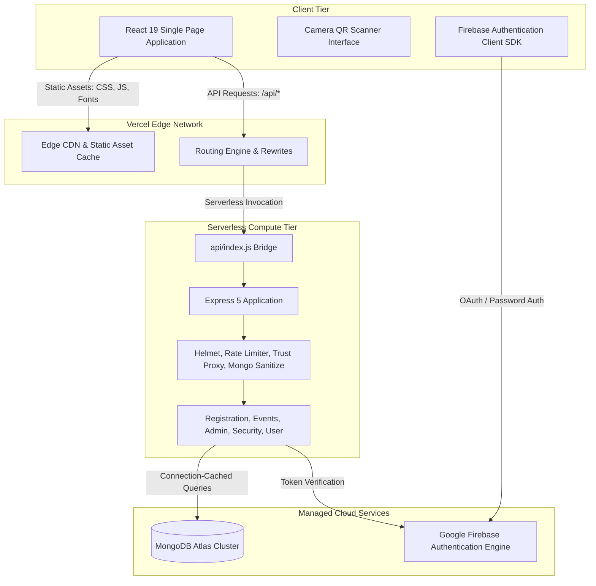

# VECTORS 2026-27

The official web platform and digital gate admission infrastructure for **VECTORS 2026-27**, the annual national technical festival of **A. C. Patil College of Engineering (ACPCE)**.

The system provides an integrated digital operations backbone for the festival, combining high-throughput attendee intake, digital credential generation, atomic QR-based gate admissions, dynamic team event validations, administrative oversight, and forensic audit logging.

---

## System Architecture



---

## Technology Stack

### Frontend Application
- **Core Framework**: React 19, Vite 8, React Router v7
- **Styling Architecture**: Tailwind CSS v4 with custom design tokens and tactical dark palette
- **Graphics & Rendering**: Three.js & `@react-three/fiber` for procedural WebGL canvas rendering, Lucide React iconography
- **Hero & Visual Direction**: Cinematic DOOM monolith citadel visual integration with high-contrast tactical telemetry HUD elements (`#00E676`)
- **Performance & Code-Splitting**: Route-level dynamic loading (`React.lazy`) and manual Rollup vendor chunking (`vendor-three`, `vendor-motion`, `vendor-firebase`, `vendor-icons`) delivering a >75% reduction in initial payload (~398 kB entry)
- **Hardware Integration**: `@yudiel/react-qr-scanner` for browser-level camera stream acquisition
- **Credential Generation**: `qrcode.react` for vector-based SVG QR rendering

### Backend API & Services
- **Runtime Environment**: Node.js (v18+)
- **API Framework**: Express 5
- **Authentication**: Google Firebase Authentication with Firebase Admin SDK token verification
- **Database & Data Modeling**: MongoDB Atlas with Mongoose 9
- **Security Middleware**:
  - `helmet`: Secure HTTP headers
  - `cors`: Explicit origin allowlist supporting production and preview environments
  - `express-rate-limit`: Multi-tier IP rate limiting with reverse proxy trust
  - `express-mongo-sanitize`: NoSQL injection query sanitization

### Infrastructure & Deployment
- **Hosting Platform**: Vercel (Edge CDN + Node.js Serverless Functions)
- **Domain & DNS**: GoDaddy Custom Domain DNS integration
- **SSL / TLS**: Automatic zero-configuration certificate provisioning via Vercel Edge

---

## Repository Structure

```text
VECTORS_26-27/
├── api/
│   └── index.js                      # Serverless function bridge for Vercel
├── client/
│   ├── index.html                    # Single Page Application entrypoint
│   ├── package.json                  # Frontend dependencies
│   ├── vite.config.js                # Build configuration and development proxy
│   ├── public/
│   │   ├── favicon.png               # Application icon
│   │   ├── vector26-logo.png         # Festival identity assets
│   │   ├── hero-bg.jpg               # Portal visual assets
│   │   └── fonts/                    # Display typography assets
│   └── src/
│       ├── App.jsx                   # Central routing and authorization guards
│       ├── components/               # Reusable UI, layout wrappers, and navigation
│       ├── contexts/AuthContext.jsx  # Authentication state machine and token sync
│       ├── data/events.js            # Festival event domain data
│       └── pages/                    # Application views (Portal, Events, Admin, Gate)
├── server/
│   ├── index.js                      # Express application configuration and exports
│   ├── package.json                  # Backend dependencies
│   ├── config/db.js                  # Database connection pooling and caching
│   ├── data/officialEvents.js        # Seed definitions for festival events
│   ├── middleware/auth.js            # Token authentication and RBAC middleware
│   ├── models/                       # Mongoose schemas (Pass, Event, User, Audit)
│   ├── routes/                       # Express route controllers
│   └── test/                         # System validation and integration test suites
├── vercel.json                       # Unified edge routing, rewrites, and security headers
├── .gitignore                        # Git exclusion rules for secrets, builds, and local configs
└── package.json                      # Monorepo workspaces and top-level lifecycle scripts
```

---

## Core System Modules

### 1. Digital Entry Pass & Identity Issuance
- Standardized attendee intake capturing verified identity, institutional affiliation, department, and contact details.
- Generation of permanent, cryptographically indexed identifiers (`VEC-XXXXXXXX`).
- Dynamic client-side QR generation encoding verifiable pass credentials for campus gate entry.

### 2. High-Throughput Gate Security & Multi-Day Check-In
- Browser-based camera QR scanner optimized for mobile and desktop camera inputs.
- Dual-role authorization restricted to authorized gate personnel (`security` and `admin`).
- **Multi-Day Attendance Engine**: Independent atomic check-in tracking for both **Day 1** and **Day 2** using a single immutable attendee QR pass.
- **Tactical Day Selector**: Gate personnel toggle between `DAY 1 SCAN` and `DAY 2 SCAN` directly within the scanner interface.
- **Race Condition & Re-Scan Protection**: Atomic `findOneAndUpdate` conditional filtering prevents duplicate entry attempts on the same day while allowing legitimate entry on Day 2.
- **Visual Credential Badging**: Real-time feedback displaying attendee name, college, and dual-day attendance badges (`Day 1: Checked In` / `Day 2: Pending`).

### 3. Event Registration Engine
- **Solo Events**: Instant credential linkage and confirmation.
- **Team Events**: Strict server-side enforcement of event-specific minimum and maximum team sizes.
- **External Integration Pipeline**: External claims without immediate roster validation are recorded as pending verification, requiring administrator review before final confirmation.

### 4. Administrative Control Suite
- **Analytics Overview**: Live metrics tracking campus check-in velocity across Day 1 & Day 2, total pass issuance, and event registrations.
- **Attendee Registry**: Searchable, paginated records with field updates, Day 1/Day 2 check-in toggles, and sanitized CSV exports.
- **Event Catalog Management**: Real-time configuration of event registration statuses and parameters.
- **Role-Based User Management**: Role elevation management (`user`, `security`, `admin`) and account controls.
- **Audit Logging**: Forensic audit trail capturing timestamps, actor emails, target entities, and pre/post modification states.

---

## REST API Specification

### Public Endpoints

| Method | Route | Description |
|---|---|---|
| `GET` | `/api/health` | Service health and database connectivity probe (`200` connected, `503` degraded) |
| `GET` | `/api/events` | List all active festival events with search and category filtering |
| `GET` | `/api/events/:slug` | Retrieve complete specifications and metadata for a specific event |
| `GET` | `/api/announcements` | Retrieve official broadcasts and pinned festival notices |

### Authenticated User Endpoints (Bearer Token Required)

| Method | Route | Description |
|---|---|---|
| `POST` | `/api/auth/sync` | Synchronize Firebase identity with MongoDB user profile |
| `GET` | `/api/user/dashboard` | Aggregated user summary including pass status, Day 1 & Day 2 check-in timestamps, and active registrations |
| `POST` | `/api/register` | Mint a verified campus Entry Pass (`VEC-XXXXXXXX`) |
| `GET` | `/api/my-pass` | Retrieve the authenticated user's digital pass details with Day 1 & Day 2 attendance stamps |
| `POST` | `/api/events/:slug/register` | Register for an event with validation of team parameters |

### Gate Security Endpoints (`security` or `admin` Role Required)

| Method | Route | Description |
|---|---|---|
| `POST` | `/api/verify/:registrationId?day=1\|2` | Perform atomic check-in on an Entry Pass for Day 1 or Day 2 (returns `VALID` or `ALREADY_CHECKED_IN` with multi-day attendance metadata) |

### Administration Endpoints (`admin` Role Required)

| Method | Route | Description |
|---|---|---|
| `GET` | `/api/admin/stats` | Aggregated system metrics, pass counts, and Day 1 / Day 2 check-in rates |
| `GET` | `/api/admin/registrations` | Paginated registry of attendee entry passes with query search |
| `PATCH` | `/api/admin/entry-registrations/:id` | Update attendee metadata or toggle manual check-in status (`day1CheckedIn`, `day2CheckedIn`) |
| `DELETE` | `/api/admin/entry-registrations/:id` | Revoke an entry pass and record audit log entry |
| `GET` | `/api/admin/event-registrations` | Searchable event registration records and team rosters |
| `PATCH` | `/api/admin/event-registrations/:id/status` | Confirm or cancel pending event registrations |
| `GET` | `/api/admin/event-registrations/export` | Download sanitized CSV export of event submissions |
| `GET` | `/api/admin/users` | Directory of registered user accounts with role assignment |
| `GET` | `/api/admin/audit-logs` | Forensic system audit log records |

---

## Security Audit & Reliability Engineering

A comprehensive full-stack security and reliability audit was conducted across the codebase to ensure enterprise-grade resilience against OWASP Top 10 vulnerabilities, race conditions, and distributed serverless failure modes.

### Security Audit & Hardening Matrix

| Threat Category | Attack Vector / Risk | Architectural Mitigation & Resolution |
|---|---|---|
| **Broken Authentication** | Client-side role claims or unverified token payloads | Cryptographic signature verification via Firebase Admin SDK; roles are mapped directly from server-side databases and secure environment configuration. |
| **Race Conditions / Double-Entry** | Concurrent requests attempting double check-in at campus entry gates | Atomic `findOneAndUpdate` conditional filtering (`checkedIn: false`) enforced at the database engine level, ensuring linear execution. |
| **NoSQL Injection** | Malicious operator payloads (`$gt`, `$ne`, `$where`) in JSON or query params | Pre-routing request sanitation using `express-mongo-sanitize` stripping operator syntax from all incoming payloads. |
| **ReDoS (Regex Denial of Service)** | Catastrophic backtracking in search and filter inputs | Special regex character sanitization and input length clamping before compilation into queries. |
| **CSV / Formula Injection** | Malicious spreadsheet formula prefixes (`=`, `+`, `-`, `@`) in attendee exports | Output encoding and formula neutralization escaping all exported string fields. |
| **Serverless Resource Exhaustion** | Connection storms and socket starvation across cold/warm function cycles | Global Mongoose connection caching and promise reuse across stateless invocation lifecycles. |
| **Client IP Spoofing** | Reverse proxy header manipulation bypassing rate limiters | Configured Express `trust proxy: 1` aligned with Vercel Edge CDN forwarding. |
| **Database Connectivity & IP Access** | Dynamic developer IP or VPN routing changes rejecting MongoDB Atlas handshakes | Health probes report status 503; client dashboard telemetry surfaces descriptive diagnostic messages directing administrators to Atlas IP Access List. |

### Automated Test Verification

The platform architecture is covered by automated integration test suites verifying critical security boundaries:
- Verification of cryptographic token rejection and access denials across unauthenticated requests.
- Enforcement of Role-Based Access Control (RBAC) preventing horizontal and vertical privilege escalation.
- Simulated concurrency tests verifying atomic check-in prevents duplicate gate admissions under load.
- Strict payload validation preventing unregistered or malformed team sizes from entering state persistence.
- Sanity checks confirming safe fallback behavior during external dependency outages.

---

## Production Deployment Architecture

The platform is designed for unified single-domain hosting on Vercel:

```text
https://yourdomain.com/         --> Static Edge Distribution (client/dist)
https://yourdomain.com/api/*    --> Serverless Function Runtime (api/index.js)
```

### Routing Configuration
- Inbound requests matching `/api/(.*)` rewrite to the serverless function handler.
- Static assets matching `/assets/(.*)` and `/fonts/(.*)` are served directly from the edge cache with immutable cache control headers.
- All non-API, non-static document requests rewrite to `/index.html` to enable client-side React Router execution without 404 errors on deep links.

### DNS Mapping
For apex and subdomain configuration on GoDaddy:
- **Apex Record**: Type `A`, Host `@`, Points to `76.76.21.21`
- **Subdomain Record**: Type `CNAME`, Host `www`, Points to `cname.vercel-dns.com.`

---

## License & Ownership

- **Event**: VECTORS 2026-27 Annual National Technical Festival
- **Institution**: A. C. Patil College of Engineering (ACPCE), Navi Mumbai, Maharashtra, India
- **Engineering & Operations**: VECTORS Technical Team
- **Intellectual Property**: Private & Proprietary. All rights reserved.
